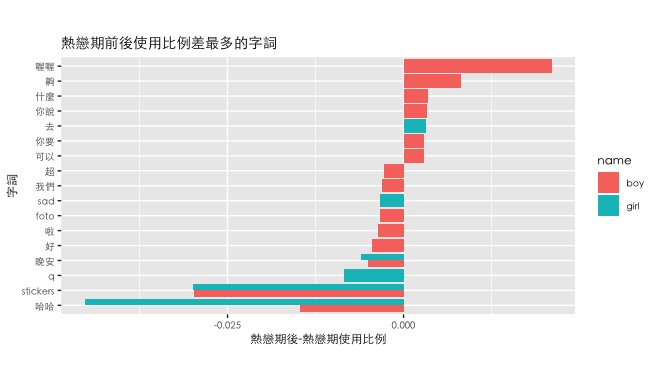
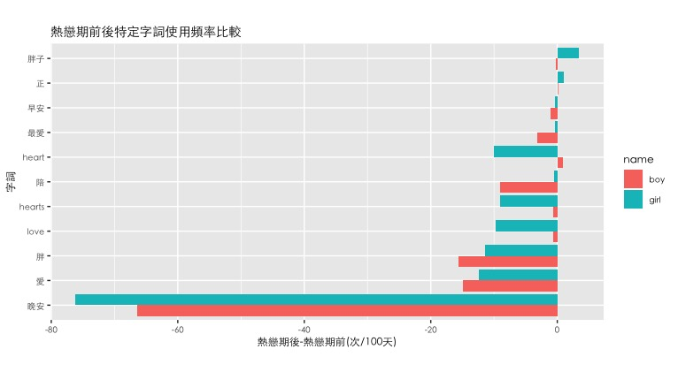
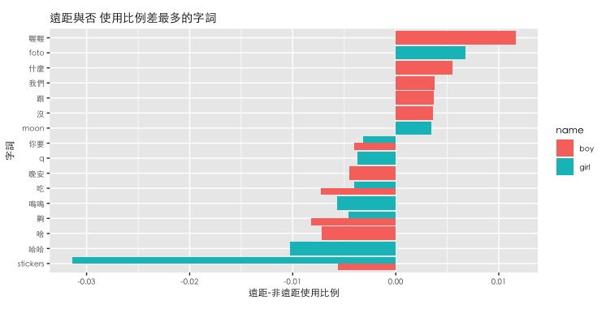
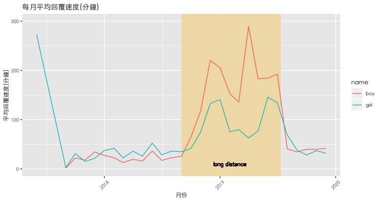
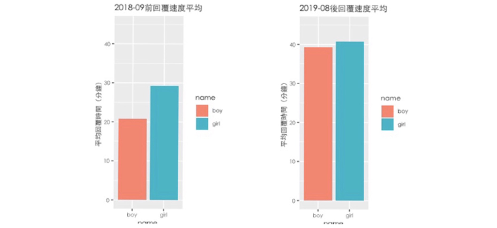

```{r setup, include=FALSE}
knitr::opts_chunk$set(echo = TRUE,comment = '#>',error=TRUE, results = 'hold', out.width='65%', fig.align = 'center', message = FALSE)
```

使用一對情侶的 Line 對話紀錄，視覺化在兩人關係(熱戀期與熱戀期後)和外在因素(遠距和非遠距)變化的同時，對話用詞及回覆速度有怎樣的改變。
此專案使用 jiebaR 套件進行斷詞，加入自訂停用詞、整理分析數據，再使用 ggplot2 及 wordcloud2 將結果視覺化。


{width=50%}


首先，圖一顯示是否為熱戀期使用比例差最多的字詞，最明顯的差別為「哈哈」和貼圖的使用比例減少許多。

{width=50%}


圖二則表現出是否為熱戀期時特定字詞使用頻率的差別，其中則是互道晚安頻率皆減少最多。此處由於對於這類甜蜜特定字詞在乎的是多久說一次，因此使用頻率而非比例來分析(此處單位為每 100 天)。

{width=50%}


由於 girl 出國交換一年，考慮到遠距時對話用詞可能改變，圖三視覺化遠距離和非遠距離時兩人分別使用比例差最多的 20 個字詞。

{width=50%}


另外，從時間方面來看，圖四用折線圖視覺化從認識以來兩人分別的每個月平均回覆對方的時間，單位為分鐘，其中 2018 年 9 月到 2019 年 7 月期間(黃底部分)，因為遠距離期間七個小時的時差關係，兩人的回覆速度皆明顯變慢。撇除這段時間，2019 年 8 月後和 2018 年 9 月以前相比(圖五)，boy 的平均回覆速度變慢了近 20 分鐘，girl 也變慢了約 4 分鐘。


{width=50%}